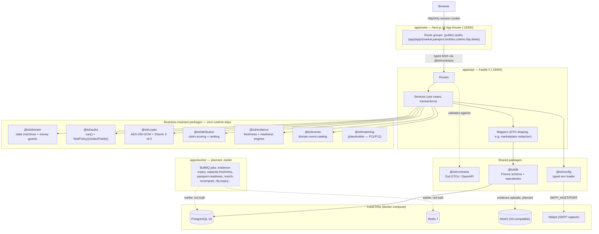
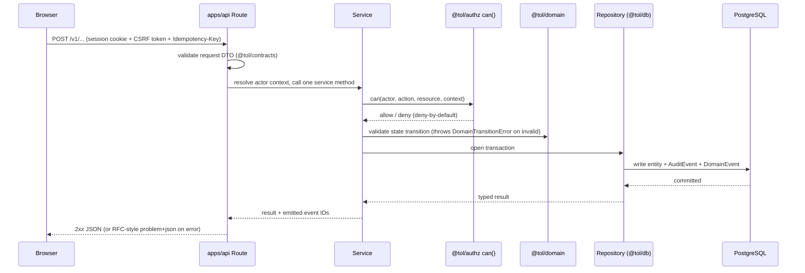

# ARCHITECTURE — TOL Platform (as built)

**Status: describes this repo as of earlier COMPLETE (2026-08-18).** Everything marked "real" below has been built, tested, and (per the build log) live-verified in a running browser against a real Postgres. Everything marked "planned" or "placeholder" has not been built — this document does not describe aspiration as if it were fact. Cross-check the build log for anything more recent than this snapshot, and the gate table for the authoritative gate-by-gate status.

*Note on scope drift: at the time this document was commissioned, earlier (Passport + Marketplace) was described as "in progress." By the time of writing, earlier had closed out completely — P5 (Marketplace), P6 (Passport), P7 (Opportunity), and P8 (Capacity) are all DONE. This document describes the actual, current state rather than the in-progress snapshot, per this repo's own accuracy discipline (the gate table: "No unresolved blocker is hidden behind a green dashboard").*

---

## 1. One-paragraph summary

TOL is a pnpm/Turborepo monorepo: three deployable units (`apps/web` — Next.js UI, `apps/api` — Fastify REST API, `apps/worker` — not yet built) and fourteen internal packages that hold the actual business logic. The architectural rule that has held since earlier and is enforced by convention throughout (the spec): **business invariants live in packages, never in route handlers or React components.** `apps/web` renders and calls typed contracts; `apps/api` coordinates use cases and repositories; the packages underneath (`domain`, `authz`, `crypto`, `attribution`, `evidence`, `matching`) hold the actual rules. Six of those packages are built with **zero runtime dependencies** — a deliberate, repeated discipline, not an accident.

## 2. Monorepo layout

```
tol-platform/
├─ apps/
│  ├─ web/        # Next.js 16 App Router UI — real (earlier–5 screens)
│  ├─ api/        # Fastify 5 REST API — real (14 modules)
│  └─ worker/     # BullMQ/Redis async jobs — earlier placeholder only
├─ packages/
│  ├─ domain/         # entities, states, invariants, money guards — real
│  ├─ db/             # Prisma schema, migrations, repositories — real (32 tables)
│  ├─ contracts/      # Zod DTOs + generated OpenAPI — real
│  ├─ authz/          # RBAC/ABAC policy, field redaction — real (10-persona matrix)
│  ├─ crypto/         # Lockbox AES-256-GCM + Shamir threshold — real
│  ├─ matching/       # eligibility + ranking engine — placeholder (P11/P12 NOT STARTED)
│  ├─ attribution/    # relationship claim scoring + disputes — real
│  ├─ evidence/       # provenance, freshness, readiness rules — real
│  ├─ connectors/     # provider adapter SDK — placeholder (deliberately deferred)
│  ├─ events/         # domain event catalog — real
│  ├─ observability/  # logging, tracing, metrics — placeholder
│  ├─ ui/             # shared design system — placeholder (one consumer so far)
│  ├─ config/         # typed environment/config loader — real
│  └─ testkit/        # fixtures, factories, fake connectors — placeholder
├─ infra/
│  ├─ docker/      # docker-compose local infra (postgres/redis/minio/mailpit real; api/worker Dockerfiles not built)
│  ├─ terraform/   # placeholder — no cloud infra provisioned
│  └─ scripts/     # placeholder
├─ docs/
│  ├─ adr/         # 11 ADRs (0001–0011), one per DECISIONS.md entry
│  ├─ api/         # generated OpenAPI output — placeholder until CI wires it
│  ├─ security/    # threat model — placeholder until P18
│  ├─ runbooks/    # this doc set — see docs/runbooks/
│  └─ product/     # THESIS.md, OWNERSHIP.md (this doc set)
├─ the (removed) review harness/        # the (removed) review script — the review harness used every build block
├─ .github/workflows/  # placeholder — no CI configured yet
├─ pnpm-workspace.yaml # the actual workspace boundary: apps/*, packages/*
├─ turbo.json
├─ docker-compose.yml
└─ README.md
```

Full package-by-package ownership table (what each package/app owns, dependency posture, license family): see `docs/product/OWNERSHIP.md` §2–3. This document focuses on how the pieces fit together at runtime, not on the IP/ownership boundary between them.

## 3. Component diagram



Dashed edges/boxes mark planned-but-not-built paths (`apps/worker`, `packages/matching`, evidence-to-MinIO uploads). Everything else is real and exercised by the integration/E2E suites named in the test evidence.

## 4. Request & auth flow

**Authentication (earlier, ADR-0007):** email+password against seeded users — real, complete, and DB-backed, but explicitly **not** the scope's eventual target (magic-link + Google OAuth, the spec), which remains deferred. Concretely:

1. `POST` to the auth module issues an HMAC-signed opaque session token, persisted in a `Session` row (DB-backed, revocable — not a stateless JWT).
2. The token is set as an **HttpOnly, Secure, SameSite** cookie (`apps/api/src/shared/session.ts`).
3. **CSRF:** double-submit token pattern on cookie-authenticated mutations.
4. **Rate limiting:** `apps/api/src/plugins/rate-limit.ts`, stricter on auth endpoints.
5. MFA has a schema field (`User.mfaEnabled`) but no enrollment/challenge flow yet — deferred, flagged, not silently missing.

**A typical mutation request**, following the route → service → repository pattern every module uses identically (earlier through earlier):



Every mutation endpoint honors `Idempotency-Key` (`apps/api/src/shared/idempotency.ts`) so a duplicate network retry replays the original result instead of creating a second record — with one documented exception: the Lockbox `release` route deliberately does **not** wrap in idempotency, because that wrapper was found (earlier review) to be persisting real decrypted plaintext into `idempotency_keys.response_body` — removed as a real security fix, not a design default (the build log earlier-stage work).

**Authorization model (`packages/authz`):** hybrid RBAC + object/purpose policy. `can(actor, action, resource, context)` is deny-by-default — a persona/action combination missing from the matrix throws at module load, not at request time, so a gap can't silently ship. Two grant paths beyond the base persona matrix, both added when the platform's first genuinely two-sided resources (RFQ, Deal Room) needed them (ADR-0008 part 1):

- **`crossOrgActions`** — a small fixed set of platform-wide actions certain roles (Platform Owner, Marketplace Operator) can take on any org's resource.
- **`AuthContext.isParticipant` + `RoleGrant.participantActions`** — lets a specific, verified non-owning counterparty (an invited provider on a merchant-owned RFQ) act on that one resource instance, computed server-side from a real DB row (`RFQRecipient`/`DealRoomParticipant`), never trusted from client input.

`fieldPolicy()`/`redactFields()` is the same package's second half: field-level redaction by role/purpose. The marketplace's entire security property (visible-market, private-deal) rests on this plus one more layer — see §6.

## 5. Data flow (Prisma / PostgreSQL)

**`packages/db` is the only package that talks to Postgres.** `apps/api` and `apps/worker` (once it exists) consume repositories; nothing outside `packages/db` imports the Prisma client directly. Repositories are deliberately "persistence-thin" — they do not contain business rules, only reads/writes shaped by `packages/domain`'s decisions.

**Schema growth by build day** (32 tables total, earlier close-out, verified via `psql \dt`):

| Day | Migration | Tables added |
|---|---|---|
| 1 | `20260818045928_init` | `Organization`, `Person`, `User`, `OrganizationMembership`, `Session`, `AuditEvent`, `IdempotencyKey` (7) |
| 2 | `20260818070743_rfq_deal_room` | `Opportunity`, `CapacityProfile`, `RFQ`, `RFQVersion`, `RFQRecipient`, `Quote`, `DealRoom`, `DealRoomParticipant`, `DealCondition`, `DealDecision`, `DomainEvent` (11) |
| 3 | `20260818101450_lockbox` | `Lockbox`, `LockboxKeyShare`, `LockboxReceipt`, `LockboxReleaseEvidence` (4) |
| 4 | `20260818121749_attribution` + `20260818123128_claim_dispute_index` | `Claim`, `ClaimEvidence`, `ClaimDecision`, `ClaimDispute` (4) |
| 5 | `20260818142823_passport_marketplace_volume` | `Passport`, `Fact`, `Evidence`, `ReadinessResult`, `VolumeSlice` (5) |

**Base audit columns** (the spec, implemented verbatim on every governed business entity — confirmed directly in `schema.prisma`): `createdAt`, `createdByUserId`, `createdByOrgId`, `updatedAt`, `updatedByUserId`, `status`, `version`, `privacyClass`, `sourceType`, `sourceReference`, `effectiveFrom`, `effectiveTo`, `retiredAt`. The actor-reference columns (`createdByUserId`/`createdByOrgId`/`updatedByUserId`) are deliberately **soft references** (plain `uuid` columns, no enforced foreign key) — an explicit design choice recorded inline in the schema so retiring an actor's account never blocks retention of the historical record it authored.

**The one documented exception:** `AuditEvent` and `DomainEvent` do **not** carry the full base-audit set (ADR-0008 part 6). Both are append-only infrastructure logs — nothing ever updates a log row, so `updated_at/by`, `version`, and `effective_from/to` have no meaning for them. Every other table in the schema (Opportunity, RFQ, Lockbox, Claim, Passport, etc.) is a governed business entity a human can edit/retire, and does carry the full set.

**Money representation is deliberately split, not unified** (ADR-0008 part 3): BigInt-backed numeric-string columns for volume-scale amounts (an `Opportunity`'s total GPV can exceed Postgres `INT4`'s ~$21.4M-in-cents ceiling almost immediately), plain `Int`/`number` for bounded, single-transaction or JSON-embedded amounts (a `Quote`'s terms, a `DealCondition`). Every currency amount is an integer minor-unit value with an explicit ISO currency code — never a float.

**Passport's `Fact.normalizedValue`** is the schema's first genuinely polymorphic JSON column (string/number/boolean/small object) — every prior JSON column was shaped like a plain object or flat string array. It's closed with a dedicated guard (`packages/db/src/json-guards.ts`'s `assertJsonSerializableValue`) that rejects `null`/`undefined` and, after an earlier review finding, `__proto__`/`constructor`/`prototype` as a key at any depth.

## 6. Marketplace redaction — the platform's own highest-stakes security property

Worth calling out on its own because an earlier build notes name it as this repo's first genuinely NEGATIVE security proof (a market-level browser must be **unable** to retrieve deal-private fields, not merely able to retrieve safe ones — ADR-0011). Two independent layers, not one:

1. **`apps/api/src/modules/marketplace/mapper.ts`** calls `@tol/authz`'s `redactFields()` with the resource's `ownerOrgId` forced to `null` for **every** caller — including the actual owning org and the Platform Owner role — so the marketplace always returns one uniform catalog shape, never a personalized one.
2. The real enforcement point is one layer further down: the mapper's own `return` statement is a **fixed, hand-picked list** of exactly 8 (capacity) / 7 (opportunity) named properties that never reads `commercialTerms`, `providerOrgId`, or exact minor-unit amounts back out of `redactFields()`'s intermediate object, for any role.

This was verified empirically, not just reasoned about — a real HTTP probe logged in as the one role with maximum `fieldPolicy()` visibility (Platform Owner) and confirmed the raw response body still excludes every private field (the test-evidence record for p5-marketplace`).

## 7. Domain state machines

Per the scope's own STATE RULE (p.5): *"Transitions happen through domain services, never arbitrary UI field edits. Every transition writes a `DomainEvent` and `AuditEvent`."* Every governed object's legal transitions live in one file in `packages/domain/src`, each throwing a shared `DomainTransitionError` base class on an invalid move:

| Object | File | States |
|---|---|---|
| Opportunity | `opportunity-states.ts` | DRAFT → READINESS_BLOCKED → MATCH_READY → INVITED → QUOTED → SELECTED → ACTIVATING → LIVE → CLOSED |
| RFQ / Quote | `rfq-states.ts` | RFQ: DRAFT → SENT → ACKNOWLEDGED → QUESTIONS → QUOTED → EXPIRED/DECLINED/SELECTED |
| Deal Room | `deal-states.ts` | OPEN → CONDITIONS → APPROVED/DECLINED → ACTIVATION → LIVE → ARCHIVED |
| Lockbox | `lockbox-states.ts` | DRAFT → SEALED → COMMITTED → FROZEN → OPENED → MATCH_ELIGIBLE; WITHDRAWN/DISPUTED side states. Also defines `LOCKBOX_RELEASE_CASCADE`, the atomic SEALED→COMMITTED→FROZEN→OPENED hop `release()` performs as one transaction. |
| Claim | `claim-states.ts` | FILED → SCORED → {VERIFIED, PARTIAL, DISPUTED, REJECTED, EXPIRED, WITHDRAWN} — Journey A's prose read as canonical over the scope's own conflicting compact table on p.5 (ADR-0010 part 4, a documented, deliberate resolution of a real ambiguity in the source scope). |
| Passport | `passport-states.ts` | DRAFT → INCOMPLETE → READY → VERIFIED → STALE → SUSPENDED. `verify()` is deliberately more restrictive than this table structurally allows — only `READY → VERIFIED`, never `STALE → VERIFIED` (ADR-0011 part 2, a service-layer policy choice on top of a looser domain-layer capability). |

`money.ts` and `volume-reconciliation.ts` in the same package hold the money-safety guards and the Opportunity volume-reconciliation engine (collapsing the scope's three separate `SUM(...)` formulas into one grand-total check over the finest-grain `VolumeSlice` rows — ADR-0011 part 4) respectively — not state machines themselves, but the same "domain owns the invariant, services call it" discipline.

**No route handler re-implements any of this.** A service calls the relevant `packages/domain` validator before writing to the database; the validator either allows the transition or throws, and `apps/api`'s central error handler turns an invalid-transition throw into a clean `400`, never a raw `500`.

## 8. Freshness: on-read, not background-worker (a named, deliberate gap)

Passport (P6) and Capacity (P8) both need a freshness/staleness classification. As of earlier, both are computed by a real, deterministic, unit-tested engine (`packages/evidence`'s `classifyCapacityFreshness`/`classifyFactFreshness`/`isPassportReadinessStale`) **every time the relevant record is read** — not by a proactive background sweep. `apps/worker` does not exist in this repo yet (earlier scope). This is a stated engineering call, not an oversight (ADR-0011 part 3): correctness of what an actual viewer sees is real today; what a future worker adds on top is *proactive* reclassification of records nobody is currently viewing (useful for notifications or marketplace-scale filtering, not required by either gate's own exit-condition text).

## 9. Gate → package mapping

Condensed from the gate table (the authoritative source — check there for anything more recent):

| Gate | Owning package(s)/app(s) | Status (earlier) |
|---|---|---|
| P0 Thesis | `docs/product` (governance, not code) | Real — see `docs/product/THESIS.md` |
| P1 Ownership | `docs/adr`, `DECISIONS.md`, `docs/product/OWNERSHIP.md` | Real — this doc set |
| P2 Personas | `packages/authz`, `docs/product` | **DONE** (earlier) |
| P3 Data | `packages/domain`, `packages/db`, `packages/contracts` | IN PROGRESS (32 tables; Relationship/Economics still gaps) |
| P4 Auth | `apps/api`, `packages/authz`, `packages/db` | **DONE** (earlier) |
| P5 Marketplace | `apps/web`, `apps/api`, `packages/contracts`, `packages/authz` | **DONE** (earlier) |
| P6 Passport | `packages/evidence`, `packages/domain`, `packages/db`, `apps/api`, `apps/web` | **DONE** (earlier, on-read) |
| P7 Opportunity | `packages/domain`, `packages/db`, `packages/contracts`, `apps/api` | **DONE** (earlier) |
| P8 Capacity | `packages/domain`, `packages/evidence`, `packages/db`, `apps/api` | **DONE** (earlier, on-read) |
| P9 Lockbox | `packages/crypto`, `apps/api`, `apps/web` | **DONE** (earlier) |
| P10 Attribution | `packages/attribution`, `apps/api` | **DONE** (earlier) |
| P11 Eligibility | `packages/matching` | NOT STARTED |
| P12 Ranking | `packages/matching` | NOT STARTED |
| P13 RFQ | `packages/domain`, `apps/api`, `apps/worker` (expiry job) | **DONE** (earlier) |
| P14 Deal Room | `apps/api`, `apps/web`, `packages/events` | **DONE** (earlier) |
| P15 Economics | `packages/domain`, `apps/api` | NOT STARTED |
| P16 Audit | `packages/events`, `packages/observability`, `apps/api` | IN PROGRESS |
| P17 Failure | `apps/worker`, `apps/api`, `packages/events`, `packages/connectors` | NOT STARTED |
| P18 Security | `packages/authz`, `packages/crypto`, `docs/security`, `.github/workflows` | NOT STARTED |
| P19 Pilot | all apps + packages, `packages/testkit` | NOT STARTED |
| P20 Canonical Release | whole repo | NOT STARTED |

## 10. Workspace verification (earlier close-out, reproduced non-cached)

- `pnpm -w run typecheck` — 20/20 tasks.
- `pnpm -w run build` — 17/17 tasks (11 "no output" warnings expected — untouched earlier placeholder packages).
- `pnpm exec turbo run test --force` — 26/26 tasks, **678 individual tests** (config 12, domain 138, evidence 41, contracts 43, attribution 68, crypto 73, db 28, events 28, authz 119, api 128; `apps/web` has no unit-test runner — see its own `package.json`, which documents why: API integration tests carry the P4/auth evidence the UI calls through to).
- Every gate marked DONE above has also been live-verified in a real browser against the real running dev stack, not just automated tests — see the test evidence for the specific walkthrough behind each one.

## 11. Forward look (earlier+, not yet built — do not read as a roadmap commitment)

Named here only because the build log's own "Next: earlier" section and the gate table already name these as the next real dependencies, not because this document is asserting a schedule:

- **`packages/matching`** (P11 Eligibility, P12 Ranking) — the next package with real dependencies to build against (`Opportunity`/`CapacityProfile` since earlier).
- **`packages/domain` Economics extension** (P15) — now has real dependencies to reference (`Claim`/`ClaimDecision` since earlier, `Passport`/`ReadinessResult` since earlier).
- **`apps/worker`** — named as a consumer by P6/P8 (freshness jobs, additive on top of the real on-read engines) and P13 (`rfq-expiry`) — three ready consumers waiting, not a design problem to solve from scratch.
- **`.github/workflows`** (P18) — no CI exists yet; every review to date has run manually via the (removed) review script.

## 12. Cross-references

- Product contract: `docs/product/THESIS.md`.
- Repo/package/IP boundary: `docs/product/OWNERSHIP.md`.
- Full gate table: the gate table.
- Decision log: `DECISIONS.md` + `docs/adr/0001`–`0011`.
- Day-by-day build log: the build log.
- Evidence behind every DONE gate: the test evidence.
- review findings history: review.
- Operational runbooks (skeleton, pilot/release): `docs/runbooks/`.
