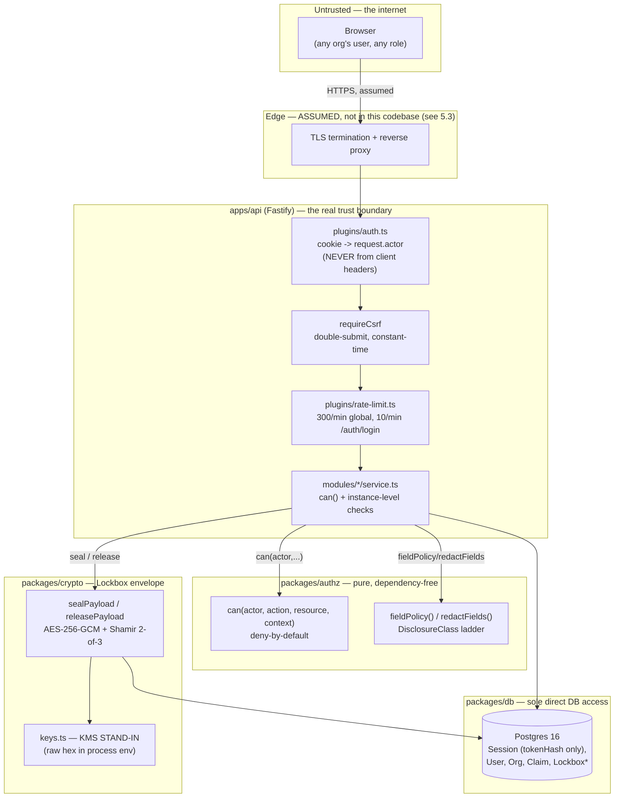

# TOL Platform — Threat Model

**Gate:** P18 Security (the gate table's exit condition: "Authz/redaction/secret scans + threat review").
**Status as of this pass:** first real threat model for this repo — `docs/security/README.md` was previously a one-line stub ("Status: empty").
**Method:** every claim below is grounded in a file this pass actually read (path cited inline) or an existing decision record (`DECISIONS.md`, the build log). Where something is inferred rather than directly verified, it's labeled `Likely:` rather than stated as fact. This document does not cover code it didn't read — see "Out of scope" at the end.

---

## 1. What this system is (for threat-modeling purposes)

TOL ("Trust Online") is a two-sided institutional marketplace: merchants/PSPs and acquirers/providers transact through RFQs, Deal Rooms, and an attribution/claims system, with a "Lockbox" mechanism for encrypted, threshold-released sensitive submissions. Ten persona roles (`packages/authz/src/roles.ts`) hold different cross-org authority; a six-tier disclosure ladder (`PUBLIC_MARKET < MEMBER_MARKET < MATCH_SUMMARY < DEAL_ROOM < RESTRICTED < SECRET`) governs field-level visibility independent of action-level authorization.

The core security thesis, confirmed by reading the code rather than assumed: **authorization and redaction are centralized in one pure, dependency-free package (`packages/authz`)**, called from every `apps/api` service before a mutation or read is allowed to proceed. There is no route that queries the database and decides visibility ad hoc.

## 2. Trust boundaries

Everything left of `apps/api` is untrusted. `request.actor.organizationId`/`role` are resolved **exclusively** server-side from `Session.activeMembership` (`apps/api/src/plugins/auth.ts`'s `onRequest` hook) — the plugin's own comment states the design intent directly: *"an attacker can send whatever X-Organization-Id header they like, nothing here ever reads one."* Confirmed by reading the hook: it never touches `request.headers` for identity, only `request.cookies[SESSION_COOKIE.name]`.

## 3. Assets, ranked by blast radius if compromised

1. **Session-signing secret (`SESSION_SECRET`)** — HMACs every session token hash (`apps/api/src/shared/session.ts`). Compromise + a stolen `tokenHash` row does *not* directly yield a forgeable raw token (HMAC is one-way), but it does let an attacker verify guesses offline and would need rotation across all live sessions if ever exposed.
2. **Lockbox KEKs (`LOCKBOX_KEK_SEALER/OPERATOR/ESCROW`) and the receipt HMAC key** — see §5.1, the platform's flagship confidentiality mechanism.
3. **Postgres** — every tenant's data, every session's `tokenHash`, every Lockbox ciphertext and wrapped share (never plaintext — see §4.3).

## 4. STRIDE analysis

### 4.1 Spoofing

| Vector | Mitigation | Evidence |
|---|---|---|
| Tenant/identity spoofing via request headers | `request.actor` derived solely from `Session.activeMembership`, resolved server-side; no header is ever read for identity | `apps/api/src/plugins/auth.ts` `onRequest` hook |
| Session token theft/replay | 32 CSPRNG bytes (`node:crypto randomBytes`), HttpOnly+Secure+SameSite=Lax cookie, DB stores only an HMAC-SHA256 hash of it — a DB dump alone never yields a usable token | `apps/api/src/shared/session.ts` |
| CSRF (cross-site request forgery, a spoofed-origin mutation) | Double-submit cookie pattern; CSRF cookie is deliberately *not* HttpOnly (client JS must echo it in `X-CSRF-Token`); comparison is constant-time (`timingSafeEqual`); enforced only on mutating methods and only when a session cookie is present (login is correctly exempt — no session yet to protect) | `apps/api/src/shared/session.ts` (`csrfTokensMatch`), `apps/api/src/plugins/auth.ts` (`requireCsrf`) |
| User enumeration via login error messages/timing | Identical error text for "no such user" and "wrong password"; a dummy bcrypt comparison runs even when the user doesn't exist, to keep the timing profile close | `apps/api/src/modules/auth/service.ts` |

### 4.2 Tampering

| Vector | Mitigation | Evidence |
|---|---|---|
| Lockbox ciphertext/share tampering | AES-256-GCM auth tag — any bit-flip on ciphertext, IV, or auth tag fails decryption closed (`TamperOrWrongKeyError`), never returns corrupted plaintext silently | `packages/crypto/src/envelope.ts`, `aes-gcm.ts`; ADR-0009 cites this proven "via bit-flips on every ciphertext/auth-tag byte" across a 72-test suite |
| Lockbox receipt tampering | HMAC-SHA256 over a canonicalized (recursively key-sorted) JSON payload; constant-time verify; never throws, always returns a boolean | `packages/crypto/src/receipt.ts` |
| Prototype pollution via redaction utility | `redactFields()` explicitly skips `__proto__`/`constructor`/`prototype` keys — added, per the code's own comment, *after* a review caught it | `packages/authz/src/field-policy.ts` |
| Silent fail-open on a malformed disclosure class | `disclosureRank()` throws on an unrecognized value instead of returning `Array.indexOf`'s `-1` (which would have satisfied `-1 <= any rank` and over-granted visibility) — another real review-caught-and-fixed issue | `packages/authz/src/roles.ts` |
| TOCTOU race on claim state (two concurrent disputes/decisions on the same claim) | `pg_advisory_xact_lock(hashtext(claimId))` serializes concurrent transactions on the same claim; the standard "re-read fresh inside the transaction" pattern alone does *not* close this gap, since re-reading only helps once one side has actually committed | `apps/api/src/modules/claims/service.ts` (`fileDispute`, `decide`) — the code's own comments document exactly why the plain re-read pattern was insufficient and cite the review that caught it |

### 4.3 Repudiation

| Vector | Mitigation | Evidence |
|---|---|---|
| Disputing that a mutation happened | Every mutation writes both an `AuditEvent` and a `DomainEvent` in the same transaction as the state change — confirmed consistently in `auth/service.ts` (login/logout/switch_org) and `claims/service.ts` (submitted/scored/disputed/dispute_decided/verified/partial/rejected) | `apps/api/src/shared/audit.ts`, `timeline.ts`, called from every service method read this pass |
| Lockbox seal repudiation | Signed HMAC receipt over `{lockboxId, ciphertextHash, sealerOrgId, sealedAt, state}` | `packages/crypto/src/receipt.ts` |

**Gap (self-disclosed in the build log, restated here because a threat model is where it belongs):** only *mutations* write an `AuditEvent`/`DomainEvent` today. **Viewing** a `RESTRICTED`-tier field does not yet generate an audit trail. For a platform whose value proposition is *gating* sensitive disclosure, "who viewed my `RESTRICTED` data and when" is not yet answerable — only "who changed what."

### 4.4 Information Disclosure

This is the deepest area of real, verified mitigation in the codebase — and also where the most significant honest residual risk lives (Lockbox key co-location, §5.1).

| Mitigation | Evidence |
|---|---|
| `can()` is deny-by-default with no implicit "if nothing matched, allow" branch — every code path returns an explicit `allow()` or falls through to a final `deny()` | `packages/authz/src/can.ts` (read in full; verified structurally, not just from its comment) |
| Field-level redaction (`fieldPolicy()`/`redactFields()`) is a *second*, independent gate on top of action-level `can()` — passing `can(actor, "organization.read", ...)` does not mean every field of that organization is visible | `packages/authz/src/field-policy.ts` |
| Cross-org visibility ceiling by role: `PLATFORM_OWNER`→`SECRET`, `MARKETPLACE_OPERATOR`/`COMPLIANCE_REVIEWER`/`AUDITOR_READONLY`→`RESTRICTED`, all other roles default to `MEMBER_MARKET` | `packages/authz/src/field-policy.ts` (`CROSS_ORG_CEILING`) |
| Cross-resource "is this caller a legitimate party to this specific instance" checks (`isParticipant`) are computed server-side from a real, freshly-queried DB row — **never** trusted from client-supplied context. Confirmed applied consistently in two independent features built on different days: RFQ/Deal Room participation (D8) and claim-dispute standing (D10) | `apps/api/src/modules/claims/service.ts`'s `computeDisputeStanding()` explicitly cites "ADR-0008/ADR-0010's isParticipant discipline" in its own comment — the same pattern, reused, not reinvented |
| Competing-claim ranking is reviewer-tier-only — a claimant reading its own claim never sees a competitor's rank or score total | `apps/api/src/modules/claims/service.ts` (`getById`), per ADR-0010 |
| Lockbox's core confidentiality property: Shamir (2-of-3) secret sharing over the DEK makes "no single stored value decrypts alone" **information-theoretically true**, not merely an access-control convention — any single share reveals zero information about the secret | `packages/crypto/src/shamir.ts`; ADR-0009 |

**Residual risk — the single biggest caveat on the platform's flagship security feature:** per ADR-0009's own text, *"`OPERATOR`/`ESCROW` KEKs both live in the same `apps/api` process's config in this single-deployment MVP."* The Shamir math genuinely requires 2 of 3 shares — but if the real-world release path combines `OPERATOR`+`ESCROW` (D9's stated normal case) and both of those KEKs sit in the same process's environment, a compromise of that one process's config exposes exactly the threshold needed to release every sealed Lockbox. The cryptographic mechanism is real and correctly implemented; the **operational** key-custody separation it depends on for its full value is not yet real. D9 flags this itself as "a conscious, visible gap for a later day's real KMS/multi-party-custody upgrade" — this threat model agrees with that assessment and elevates it to the top of the residual-risk list.

### 4.5 Denial of Service

| Mitigation | Evidence |
|---|---|
| Global rate limit: 300 requests/min, keyed by `actor.userId` when authenticated, else IP | `apps/api/src/plugins/rate-limit.ts` |
| Stricter tier on the brute-force/credential-stuffing surface: `/auth/login` overridden to 10 requests/min | `apps/api/src/modules/auth/routes.ts` |

**Gap (verified by grepping the entire `apps/api/src` tree for every `rateLimit` reference — `/auth/login` is the *only* route-level override that exists):** the spec explicitly calls for "stricter limits for auth, **exports and cryptographic release endpoints**" — three named categories. Only the first has a stricter tier implemented today. `lockbox.release` is a real, live authorized action (`packages/authz/src/can.ts`) that triggers threshold key reconstruction and decryption — arguably the single most expensive and most sensitive operation in the system — and it currently runs under the same generic 300/min ceiling as an ordinary list endpoint. No export endpoints exist yet at all, so that third named category is moot for now, but the release gap is real and live today.

*(Note: the `pg_advisory_xact_lock` calls in `claims/service.ts` serialize concurrent writers on one specific `claimId` — that's a correctness mechanism, not a DoS control, and doesn't slow a flood of distinct claim IDs. Mentioned here only to head off conflating the two.)*

### 4.6 Elevation of Privilege

| Mitigation | Evidence |
|---|---|
| Self-certification guard: a reviewer can never decide a claim their own organization filed, regardless of which decider role is calling — an instance-level rule `can()`'s action-level model cannot express on its own | `apps/api/src/modules/claims/service.ts` (`decide`) — the file's header comment explains directly why this needed a dedicated service-layer check on top of `can()` |
| `rfq.create` restricted to operator roles via `crossOrgActions`, not available to the merchant who owns the underlying `Opportunity` — confirmed live by a dedicated integration test | ADR-0008 part 7, cites `apps/api/tests/integration/rfqs.test.ts` expecting a clean 403 for a merchant session |
| Dispute standing requires a real, server-computed reason (being the claim's own subject org, or holding a competing claim on the same subject+opportunity pair) — a claimant cannot dispute an arbitrary unrelated claim just by calling the endpoint | `apps/api/src/modules/claims/service.ts` (`computeDisputeStanding`) |

**Gap (self-disclosed in ADR-0007, restated here because it's an elevation-of-privilege-adjacent concern, not just a UX one):** authentication is real, complete email+password (bcrypt) with DB-backed revocable sessions — but magic-link and Google OAuth (the spec's eventual MVP requirement) remain deferred, and **MFA has a schema field (`User.mfaEnabled`) with no enrollment or challenge flow yet.** A compromised password with no second factor is a materially bigger concern for `PLATFORM_OWNER`/`MARKETPLACE_OPERATOR`-tier accounts (which hold `crossOrgActions`) than for an ordinary merchant user — the schema is ready for MFA; the flow isn't built.

## 5. Current MVP limitations (honest, not hedged)

1. **No CI has run yet.** There is no GitHub remote configured for this repo as of this pass. Every workflow added alongside this document (`.github/workflows/ci.yml`, `security.yml`, `migration-check.yml`) is authored against this repo's real scripts, real `.env.example` contract, and real file paths — but has zero execution history. Treat them as reviewed-on-paper, not proven-in-practice, until the first real run.
2. **KMS is an explicit stand-in, not a placeholder someone forgot.** `packages/crypto/src/keys.ts`'s own header comment states production would source every Lockbox KEK and the receipt-signing key from a real KMS/HSM; today they're raw hex in process environment variables, converted to `Buffer`s at service construction. This is documented, not silent — but it's still the actual current state.
3. **TLS terminates in front of the API — assumed, not implemented in this codebase.** Nothing in `apps/api` handles TLS; Fastify runs plain HTTP here. The `Secure` cookie flag and the entire CSRF/session model's real-world safety depend on a reverse proxy or load balancer doing TLS termination correctly in front of it. That component doesn't exist in this repository and wasn't reviewed as part of this pass — it's a hard, currently-undocumented-in-code deployment dependency.
4. **Lockbox `OPERATOR`+`ESCROW` KEK co-location** — see §4.4's residual risk; the platform's flagship confidentiality mechanism has a real operational gap between its cryptographic guarantee and its current key-custody reality.
5. **No view-time audit trail** — see §4.3; only mutations are audited today.
6. **`lockbox.release` lacks a stricter rate-limit tier** despite scope explicitly naming it — see §4.5.
7. **Lockbox release's `conditionRef` is structurally validated (a UUID) but not yet cross-checked against a live, resolved `DealCondition` row** — per the build log's own "deliberate and documented" scope-cut note. A release can currently reference a condition ID without the system verifying that condition is actually satisfied.
8. **No MFA enrollment/challenge flow** despite a ready schema field — see §4.6.

None of these are being fixed by this pass — per this task's own scope, they're observations for whoever picks up the next round of `apps/api`/`packages/*` work, not something this CI/docs-only pass touches.

## 6. Out of scope for this document

This pass read `packages/authz`, `packages/crypto`, `packages/attribution`'s consumer (`apps/api/src/modules/claims`), and `apps/api`'s auth/session/CSRF/rate-limit layer in detail. It did **not** read `apps/web` (frontend trust model, XSS surface, client-side state), `packages/connectors`, `packages/matching`, `packages/evidence`, `packages/observability`, `apps/worker`, or `infra/terraform`. Nothing in this document should be read as a claim — positive or negative — about those areas. A future pass should extend this threat model to them rather than assume coverage that doesn't exist yet.

## 7. References

- the gate table — P18 row
- `docs/adr/` — ADR-0007 (auth mechanism), ADR-0008 (RFQ/Deal Room authz, `isParticipant`), ADR-0009 (Lockbox crypto), ADR-0010 (attribution/claim model)
- the build log — current-state gap notes (CI, field-view audit, Lockbox `conditionRef`)
- `docs/adr/0007-auth-email-password.md`, `0009-lockbox-crypto.md`, `0010-attribution-scoring-and-claim-model.md`
